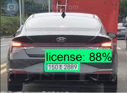

# Mobilenet-SSD-to-detect-Licence-Plate
This is a project aimed to detect vehicle licence plates with Mobilenet SSD v2.  
Licence Plate Detector utilizes Tensorflow Object Detection Api.

## Labelling the dataset
To label the dataeset, I've used [LabelImg](https://github.com/tzutalin/labelImg)  
Further, I've created some python macro to:  
1. [to change names in XML file in case the name of the label is incorrect](Preprocessing-Macros/xmlmacro.py)  
2. [to increase the number of dataset after augmenting the data](Preprocessing-Macros/preprocessor.py)  
3. [to inspect if the given dataset is trainable](Preprocessing-Macros/inspect_model.py)

## Training and exporting the dataset
To train and export the dataset, I have utilized [TensorFlow 2 Object Detection API tutorial](https://tensorflow-object-detection-api-tutorial.readthedocs.io/en/latest/) 
Please refer to [DataProcessor.ipynb](DataProcessor.ipynb) to see the training and exporting process more in detail 
After exporting the trained dataset

## Making use of the exported dataset
To detect the image using the exported data, refer [here](detector_image.py)
To detect the video/webcam using the exported data, refer [here](test_detector_video.py)
If the confidence score is above 40%, the license plate can be captured to be changed to grayscale

## Result
Some sample results are as follows:

